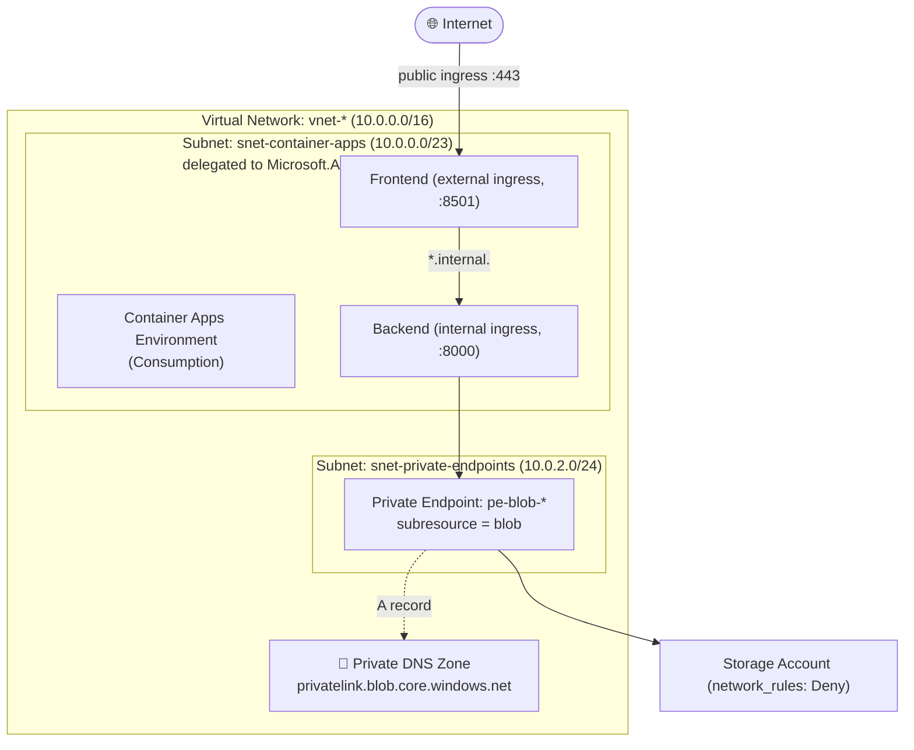
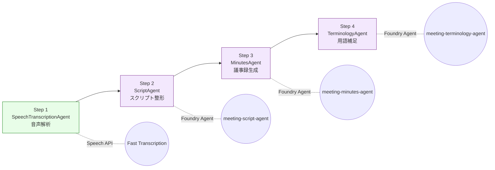
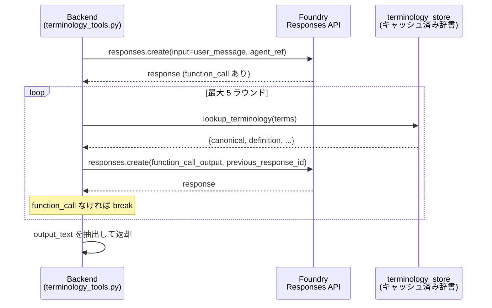
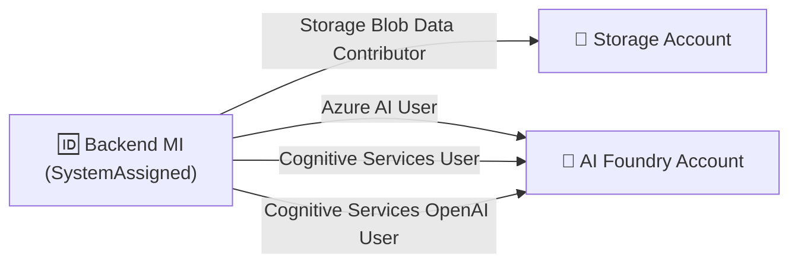
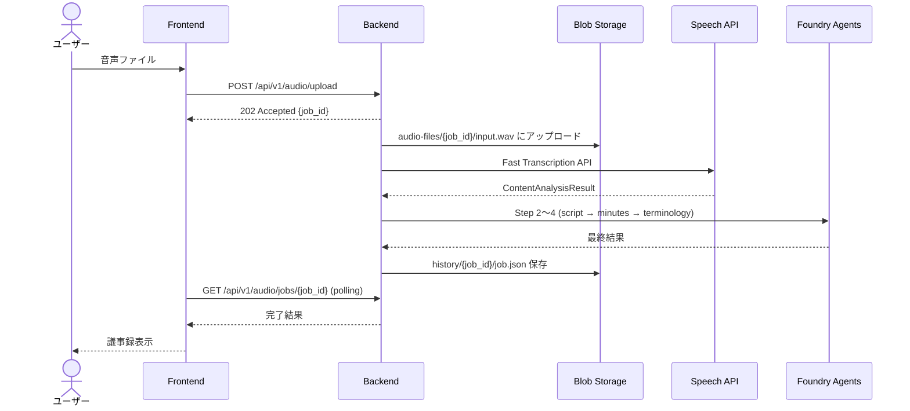
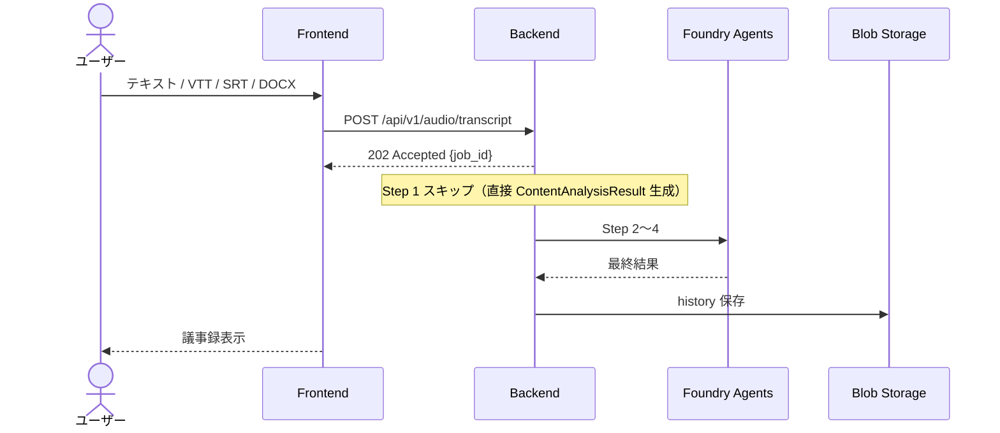

# Meeting Minutes Agent — アーキテクチャ詳細

> **最終更新日**: 2026-05-11

---

## 1. コンポーネント構成

### 1.1 フロントエンド (`frontend/`)

| 項目 | 値 |
|------|----|
| フレームワーク | Streamlit |
| エントリポイント | `app.py` |
| Docker ベースイメージ | `python:3.12-slim` |
| ポート | 8501 |
| 主要依存 | `streamlit`, `requests`, `pandas`, `python-docx` |

**主要機能**:
- 音声ファイルのアップロード UI（ドラッグ & ドロップ / ファイル選択）
- テキスト入力 UI（直接入力 / VTT・SRT・DOCX ファイルアップロード）
- ブラウザ録音機能
- ジョブ進捗のリアルタイム表示（ステータスポーリング）
- 議事録の Markdown レンダリング＋ダウンロード
- エージェント入出力の詳細パネル（Step 1〜4 の中間結果表示）
- 履歴一覧・閲覧・削除

### 1.2 バックエンド (`backend/`)

| 項目 | 値 |
|------|----|
| フレームワーク | FastAPI |
| エントリポイント | `app/main.py` |
| Docker ベースイメージ | `python:3.12-slim` |
| ポート | 8000 |
| ヘルスチェック | `GET /health` |

**ルーター構成**:

| ルーター | プレフィックス | ファイル |
|----------|--------------|---------|
| Audio | `/api/v1` | `routers/audio.py` |
| History | `/api/v1` | `routers/history.py` |

**主要依存**:
- `fastapi`, `uvicorn`, `pydantic`, `pydantic-settings`, `python-multipart`
- `openai` (2.0+) — Responses API 経由で Foundry Agent を呼び出し
- `azure-ai-projects` (2.1+) — Foundry Project / Agent 管理
- `azure-ai-agents` (1.1+) — AgentsClient
- `azure-identity` — DefaultAzureCredential
- `azure-storage-blob` — Blob Storage 接続
- `httpx` — Speech Fast Transcription API 呼び出し
- `pydub` — 音声ファイルの正規化（16 kHz/16-bit/mono WAV リサンプル、ffmpeg 必須）
- `aiofiles` — 非同期ファイル I/O
- `aiohttp` — 非同期 HTTP クライアント

### 1.3 エージェントモジュール (`backend/app/agents/`)

| モジュール | 役割 |
|------------|------|
| `speech_transcription.py` | Blob アップロード（アーカイブ）+ Azure Speech Fast Transcription で音声→テキスト変換 |
| `script_agent.py` | 生テキストを整形スクリプトに変換 |
| `minutes_agent.py` | スクリプトから構造化議事録を生成 |
| `terminology_agent.py` | 議事録に用語集を付与 |
| `pipeline.py` | 4 エージェントの順次実行オーケストレーション |
| `foundry_client.py` | Microsoft Foundry / Azure OpenAI クライアントの共有インスタンス |
| `terminology_tools.py` | Foundry Prompt Agent の Function Calling ループ実装 |
| `terminology_store.py` | Blob Storage / ローカルからの用語辞書読み込み＋キャッシュ |
| `history_store.py` | 完了ジョブの Blob 永続化＋取得 |

---

## 2. 通信経路

### 2.1 ネットワーク構成

- **Frontend**: 外部イングレス（パブリック HTTPS）— ユーザーがブラウザからアクセス
- **Backend**: 内部イングレスのみ — VNet 内からのみ到達可能（インターネット非公開）
- **通信経路**: Frontend → Backend は `https://{backend-name}.internal.{env-domain}` で接続
- **Foundry への通信**: Backend → Foundry (AIServices — Speech + GPT) は Managed Identity で認証
- **Blob Storage への通信**: `network_rules { default_action = "Deny", bypass = ["AzureServices"] }` のため、VNet 内の Private Endpoint + Private DNS Zone 経由でアクセス
- **Container Registry**: Premium SKU + `public_network_access_enabled = false` + Private Endpoint 経由でイメージプル
- **Log Analytics**: Container Apps Environment からのログ送信は Azure バックボーン内で完結

**サブネット構成**:

| サブネット | CIDR | 用途 |
|-----------|------|------|
| `snet-container-apps` | `10.0.0.0/23` | Container Apps Environment（委任済み） |
| `snet-private-endpoints` | `10.0.2.0/24` | Storage / ACR / AI Services の Private Endpoint |

### 2.2 ネットワーク詳細図



---

## 3. AI エージェントパイプライン

### 3.1 パイプライン概要

4 つのエージェントが**順次実行**され、各ステップの出力が次のステップの入力となる。



### 3.2 Foundry Prompt Agent

Step 2〜4 は **Microsoft Foundry Prompt Agent** として事前登録されている。

| agent_key | Foundry Agent 名 | 目的 |
|-----------|-------------------|------|
| `script` | `meeting-script-agent` | スクリプト整形 + 用語正規化 |
| `minutes` | `meeting-minutes-agent` | 構造化議事録生成 + 用語インライン注釈 |
| `terminology` | `meeting-terminology-agent` | 用語集セクション追加 |

### 3.3 Function Calling ループ



### 3.4 フォールバック

各エージェントは Foundry / Azure OpenAI が未設定の場合、モック結果を返す。これにより、AI サービスなしでもローカル開発が可能。

---

## 4. 用語辞書システム

### 4.1 概要

「Single Source of Truth」パターンで、1 つの JSON 辞書ファイルが全エージェントに共有される。

### 4.2 辞書スキーマ

```json
{
  "phrase_list": ["MCP", "Azure OpenAI"],
  "term_mappings": [
    {
      "variants": ["えむしーぴー", "エムシーピー", "MCP"],
      "canonical": "MCP",
      "definition": "Model Context Protocol。AI とデータソース/ツールを接続するプロトコル。",
      "category": "tech"
    }
  ]
}
```

### 4.3 読み込み優先順位

1. **Azure Blob Storage** (`terms` コンテナの `terminology.json`) — Managed Identity で取得
2. **ローカルファイル** (`backend/app/data/terminology.json`) — Blob が取得不可の場合にフォールバック

### 4.4 カスタマイズオプション

詳細は [custom-terminology-options.md](custom-terminology-options.md) を参照。

---

## 5. セキュリティ

### 5.1 認証方式

**すべて Managed Identity (DefaultAzureCredential)** を使用。API キー・SAS トークンは不使用。

| 接続先 | 認証スコープ |
|--------|-------------|
| Azure Speech API | `https://cognitiveservices.azure.com/.default` |
| Azure OpenAI (直接) | `https://cognitiveservices.azure.com/.default` |
| Foundry Responses API | `https://ai.azure.com/.default` |
| Azure Blob Storage | DefaultAzureCredential（RBAC ベース） |

### 5.2 クライアント初期化の優先順位

1. `foundry_project_endpoint` が設定 → `AsyncOpenAI` (base_url = `{project}/openai/v1/`)
2. `azure_openai_endpoint` が設定 → `AsyncAzureOpenAI` (レガシーフォールバック)
3. 両方未設定 → モック動作

### 5.3 ストレージ認証

`shared_access_key_enabled = false` により、アカウントキーでのアクセスは完全に無効化。すべて RBAC ベースの Managed Identity 認証。

### 5.4 RBAC ロールアサインメント

Backend の System Managed Identity に対する割り当て:

| ロール | スコープ | 用途 |
|--------|---------|------|
| `Storage Blob Data Contributor` | Storage Account | Blob 読み書き (audio, terms, history) |
| `Cognitive Services User` | AI Services Account | Speech Fast Transcription |
| `Azure AI User` | AI Services Account | Foundry Project / Agent 操作 |
| `Cognitive Services OpenAI User` | AI Services Account | GPT モデル推論 |



---

## 6. データフロー

### 6.1 音声ファイル入力



### 6.2 テキスト入力



---

## 7. インフラストラクチャ

### 7.1 Terraform モジュール構成

```
infra/
├── main.tf / variables.tf / outputs.tf / providers.tf
└── modules/
    ├── ai_services/        # Foundry Account (AIServices) + Project + GPT Deployment
    ├── storage/            # Storage Account + 3 Containers + Private Endpoint + DNS Zone
    ├── networking/         # VNet + CA Subnet + PE Subnet
    ├── container_registry/ # ACR
    └── container_apps/     # CAE + Backend CA + Frontend CA
```

### 7.2 Azure リソース一覧

| リソース | 名前パターン | 説明 |
|----------|-------------|------|
| Resource Group | `rg-meeting-minutes-agent` | 全リソースの親 |
| AI Services Account | `aif-{app}-{env}` | Foundry 互換 AIServices |
| Foundry Project | `proj-{app}-{env}` | Foundry プロジェクト |
| GPT Deployment | `gpt-5.4` | GlobalStandard SKU、30K TPM |
| Storage Account | `st{app}{env}` | Blob Storage |
| Blob Containers | `audio-files` / `terms` / `history` | 用途別 3 コンテナ |
| Virtual Network | `vnet-{app}-{env}` | 10.0.0.0/16 |
| Private Endpoint | `pe-blob-{sa_name}` | Blob Storage への Private Link |
| Private DNS Zone | `privatelink.blob.core.windows.net` | PE の名前解決 |
| Container Registry | `acr{app}{env}` | コンテナイメージ管理 |
| Log Analytics | `law-{app}-{env}` | ログ集約 |
| Container Apps Env | `cae-{app}-{env}` | VNet 統合、Consumption |
| Backend CA | `ca-backend-{app}-{env}` | 内部イングレス、1-5 レプリカ |
| Frontend CA | `ca-frontend-{app}-{env}` | 外部イングレス、1-3 レプリカ |

### 7.3 環境別リソース名

命名規則: `<prefix>-<app_name>-<environment>`（例: `cae-mtgminutes-prod`）

`<env>` を `dev` / `staging` / `prod` に置換:

| リソース種別 | dev | staging | prod |
|-------------|-----|---------|------|
| VNet | `vnet-mtgminutes-dev` | `vnet-mtgminutes-staging` | `vnet-mtgminutes-prod` |
| CAE | `cae-mtgminutes-dev` | `cae-mtgminutes-staging` | `cae-mtgminutes-prod` |
| Backend CA | `ca-backend-mtgminutes-dev` | `ca-backend-mtgminutes-staging` | `ca-backend-mtgminutes-prod` |
| Frontend CA | `ca-frontend-mtgminutes-dev` | `ca-frontend-mtgminutes-staging` | `ca-frontend-mtgminutes-prod` |
| Storage | `stmtgminutesdev` | `stmtgminutesstaging` | `stmtgminutesprod` |
| ACR | `acrmtgminutesdev` | `acrmtgminutesstaging` | `acrmtgminutesprod` |
| AI Foundry | `aif-mtgminutes-dev` | `aif-mtgminutes-staging` | `aif-mtgminutes-prod` |

---

## 8. 前提・制約事項

### 8.1 Speech API の方式選択

| 項目 | Fast Transcription | Batch Transcription |
|------|-------------------|---------------------|
| API パス | `:transcribe` | `:submit` |
| 処理方式 | 同期 | 非同期（ポーリング） |
| 音声入力 | `audioUrl`（Blob URL） | `contentUrls`（Blob URL 配列） |
| 最大音声長 | diarization 有効時 2 時間未満 | 240 分/ファイル |
| 話者分離設定 | `diarization: {maxSpeakers: N, enabled: true}` | `diarizationEnabled: true` + `diarization: {minCount, maxCount}` |

### 8.2 Content-Type バリデーション

`.mp4` ファイルはブラウザが `video/mp4` として送信するため、`audio/*` に加えて `video/mp4`、`video/webm`、`video/ogg` も許可。pydub (ffmpeg) が音声トラックを抽出する。

### 8.3 Storage ネットワーク

| 項目 | 値 |
|------|----|
| `network_rules.default_action` | `Deny` |
| `network_rules.bypass` | `["AzureServices"]` |
| Private Endpoint | Container Apps → Blob Storage |
| `shared_access_key_enabled` | `false` |
