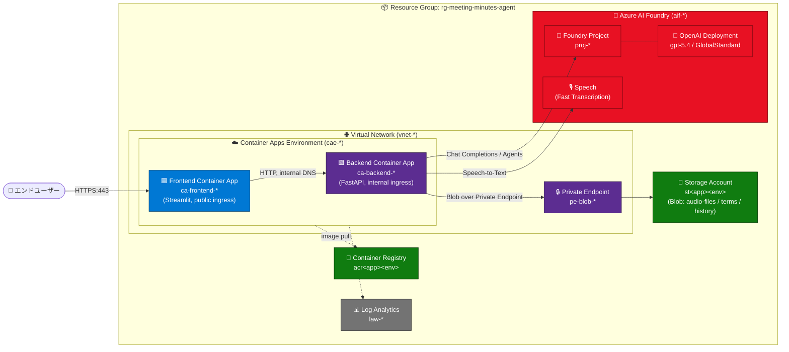
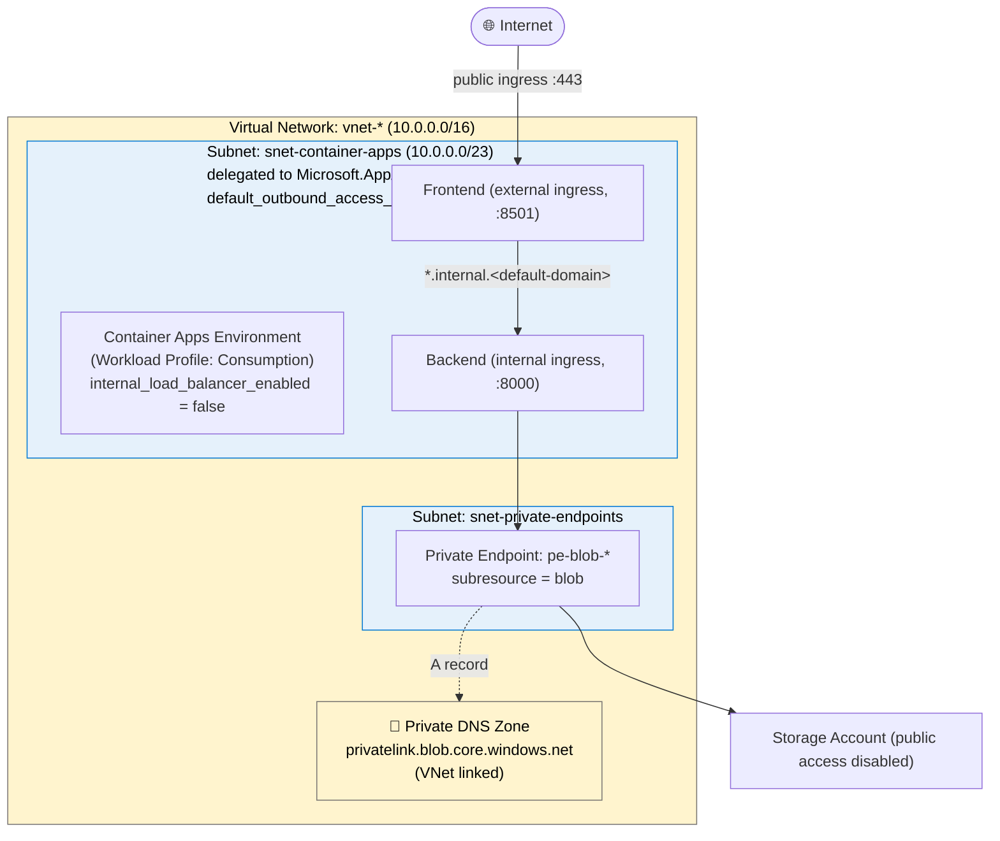
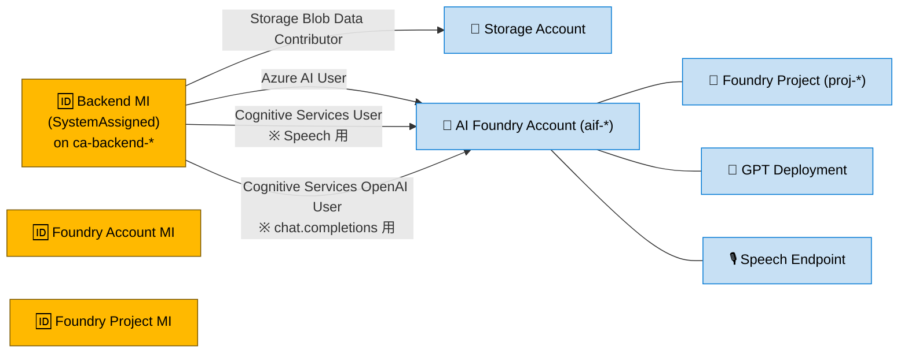
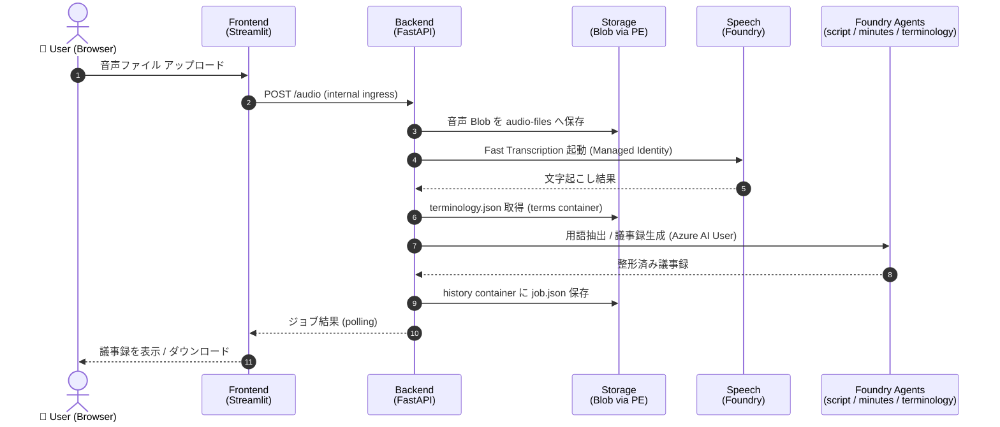

# インフラ構成図（Azure / Terraform）

本ドキュメントは [`infra/`](../infra/main.tf) 配下の Terraform 定義から生成した、**Meeting Minutes Agent** の Azure 構成図です。
`dev` / `staging` / `prod` のすべての環境で同一トポロジーを採用しているため、図はトポロジー共通として 1 セット示し、環境ごとに変わるのは **リソース名のサフィックス** と **タグ** のみです（[環境別リソース名一覧](#5-環境別リソース名一覧) を参照）。

> 命名規則: `<prefix>-<app_name>-<environment>`（例: `cae-mtgminutes-prod`）
> `app_name` の既定値は `mtgminutes`（[`infra/variables.tf`](../infra/variables.tf)）

---

## 目次

1. [全体俯瞰図](#1-全体俯瞰図)
2. [ネットワーク構成（VNet / Subnet / Private Endpoint）](#2-ネットワーク構成vnet--subnet--private-endpoint)
3. [ID と RBAC（Managed Identity と権限割り当て）](#3-id-と-rbacmanaged-identity-と権限割り当て)
4. [リクエスト / データフロー](#4-リクエスト--データフロー)
5. [環境別リソース名一覧](#5-環境別リソース名一覧)

---

## 1. 全体俯瞰図

リソースグループ単位の全体像です。フロントエンドだけが公開され、バックエンド・ストレージは VNet 内部からのみアクセス可能な構成です。

---

## 2. ネットワーク構成（VNet / Subnet / Private Endpoint）

VNet 内部の Subnet 分割と Private Endpoint / Private DNS Zone を示します。

**ポイント**

- Container Apps Environment は VNet 統合 (`infrastructure_subnet_id`) しているが、**外部 LB あり** (`internal_load_balancer_enabled = false`) なので Frontend のみ公開できる。
- Backend は `external_enabled = false` で内部ドメイン (`*.internal.<env-default-domain>`) のみ。
- Storage は `public_network_access_enabled = false` + `shared_access_key_enabled = false`。アクセスは **Private Endpoint + Managed Identity** のみ。

---

## 3. ID と RBAC（Managed Identity と権限割り当て）

データプレーン認証はすべて **System-Assigned Managed Identity** + **Azure RBAC** に統一しています（API キー / 接続文字列なし）。

**割り当て一覧**（[`infra/main.tf`](../infra/main.tf)）

| Principal | Scope | Role |
| --- | --- | --- |
| Backend Container App MI | Storage Account | `Storage Blob Data Contributor` |
| Backend Container App MI | Foundry Account | `Azure AI User` |
| Backend Container App MI | Foundry Account | `Cognitive Services User` |
| Backend Container App MI | Foundry Account | `Cognitive Services OpenAI User` |

---

## 4. リクエスト / データフロー

ユーザーが音声をアップロードしてから議事録が返るまでの典型シーケンス。

---

## 5. 環境別リソース名一覧

すべて命名サフィックスのみが異なります。`<env>` を `dev` / `staging` / `prod` に置換してください。

| リソース種別 | リソース名パターン | dev | staging | prod |
| --- | --- | --- | --- | --- |
| Resource Group | `rg-meeting-minutes-agent` | 同左 | 同左 | 同左 |
| VNet | `vnet-mtgminutes-<env>` | `vnet-mtgminutes-dev` | `vnet-mtgminutes-staging` | `vnet-mtgminutes-prod` |
| Container Apps Subnet | `snet-container-apps` | 同左 | 同左 | 同左 |
| Private Endpoints Subnet | `snet-private-endpoints` | 同左 | 同左 | 同左 |
| Container Apps Env | `cae-mtgminutes-<env>` | `cae-mtgminutes-dev` | `cae-mtgminutes-staging` | `cae-mtgminutes-prod` |
| Backend Container App | `ca-backend-mtgminutes-<env>` | `ca-backend-mtgminutes-dev` | `ca-backend-mtgminutes-staging` | `ca-backend-mtgminutes-prod` |
| Frontend Container App | `ca-frontend-mtgminutes-<env>` | `ca-frontend-mtgminutes-dev` | `ca-frontend-mtgminutes-staging` | `ca-frontend-mtgminutes-prod` |
| Log Analytics | `law-mtgminutes-<env>` | `law-mtgminutes-dev` | `law-mtgminutes-staging` | `law-mtgminutes-prod` |
| AI Foundry Account | `aif-mtgminutes-<env>` | `aif-mtgminutes-dev` | `aif-mtgminutes-staging` | `aif-mtgminutes-prod` |
| Foundry Project | `proj-mtgminutes-<env>` | `proj-mtgminutes-dev` | `proj-mtgminutes-staging` | `proj-mtgminutes-prod` |
| OpenAI Deployment | `<openai_model_name>` | `gpt-5.4` | `gpt-5.4` | `gpt-5.4` |
| Storage Account | `stmtgminutes<env>` (24 文字以内 / lower / no hyphen) | `stmtgminutesdev` | `stmtgminutesstaging` | `stmtgminutesprod` |
| Blob Containers | `audio-files` / `terms` / `history` | 同左 | 同左 | 同左 |
| Private Endpoint (Blob) | `pe-blob-stmtgminutes<env>` | `pe-blob-stmtgminutesdev` | `pe-blob-stmtgminutesstaging` | `pe-blob-stmtgminutesprod` |
| Private DNS Zone | `privatelink.blob.core.windows.net` | 同左 | 同左 | 同左 |
| Container Registry | `acrmtgminutes<env>` (50 文字以内 / lower / no hyphen) | `acrmtgminutesdev` | `acrmtgminutesstaging` | `acrmtgminutesprod` |

### 環境差分パラメーター（既定値）

| パラメーター | dev | staging | prod | 出典 |
| --- | --- | --- | --- | --- |
| `location` | `japaneast` | `japaneast` | `japaneast` | [`variables.tf`](../infra/variables.tf) |
| `acr_sku` | `Basic` | `Standard` 推奨 | `Premium` 推奨 | [`variables.tf`](../infra/variables.tf) |
| `openai_deployment_capacity` (k TPM) | `30` | 用途に応じて | 用途に応じて | [`variables.tf`](../infra/variables.tf) |
| `storage_replication_type` | `LRS` | `LRS` | `ZRS` / `GRS` 推奨 | [`variables.tf`](../infra/variables.tf) |
| `tag_environment` (タグ値) | 現状 `Hybrid`（共通） | 同左 | 同左 | [`terraform.tfvars`](../infra/terraform.tfvars) |

> 現在 [`infra/terraform.tfvars`](../infra/terraform.tfvars) では `environment = "dev"` のみが設定されています。staging / prod を立てる場合は、別 tfvars または別 workspace を用意し、`environment` と上記差分値を切り替えてください。

---

## 参考

- 全体設計: [`docs/system-design.md`](./system-design.md)
- 用語管理オプション: [`docs/custom-terminology-options.md`](./custom-terminology-options.md)
- Terraform エントリポイント: [`infra/main.tf`](../infra/main.tf)
