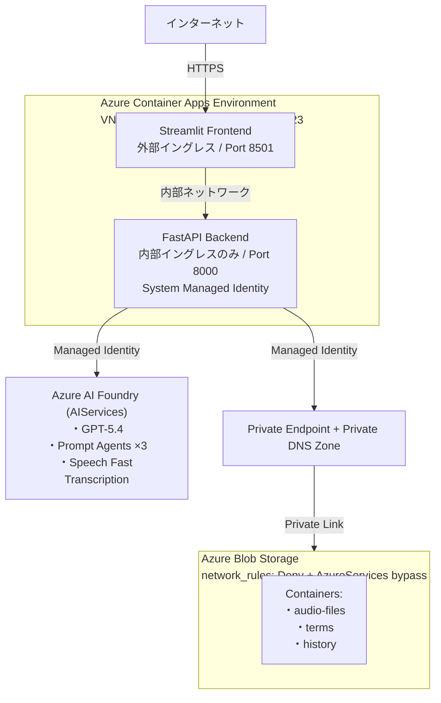
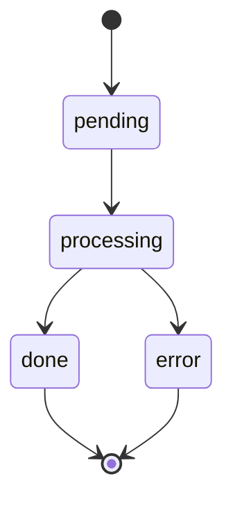
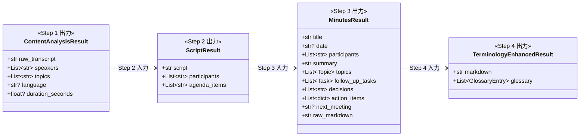

# Meeting Minutes Agent — 要件定義

> **最終更新日**: 2026-05-11

---

## 1. システム概要

### 1.1 目的

音声ファイルまたは文字起こしテキストから、複数の AI エージェントが連携して構造化された議事録を自動生成するシステム。

### 1.2 システム構成図

```
音声ファイル / テキスト
  └─► [音声解析エージェント]              … Azure Speech Fast Transcription で文字起こし（話者分離対応）
        └─► [スクリプト生成エージェント]     … 読みやすい会議スクリプトを作成
              └─► [議事録作成エージェント]   … 決定事項・アクションアイテム等を整理
                    └─► [用語補足エージェント] … 業界/社内用語の用語集を付加
```



---

## 2. 機能要件

### 2.1 入力

| 機能 | 説明 |
|------|------|
| 音声アップロード | WAV / MP3 / MP4 / M4A / OGG / WebM / FLAC 形式に対応（最大 100MB） |
| ブラウザ録音 | マイクで直接録音し、そのまま議事録生成を開始 |
| テキスト入力 | 文字起こし済みテキスト / VTT / SRT / DOCX ファイルの直接投入 |

### 2.2 処理

| 機能 | 説明 |
|------|------|
| 話者分離 | Azure Speech Fast Transcription による最大 10 名の話者識別 |
| 4 段パイプライン | 音声解析 → スクリプト整形 → 議事録生成 → 用語補足 |
| 用語正規化 | Blob Storage 上の辞書を Function Calling ツールで参照し、表記統一＋インライン注釈 |
| 非同期処理 | ジョブベースのポーリング方式（HTTP 202 → ステータスポーリング → 完了） |

### 2.3 出力

| 機能 | 説明 |
|------|------|
| 議事録表示 | Markdown 形式でレンダリング（タイトル・参加者・議題・決定事項・アクションアイテム・用語集） |
| ダウンロード | Markdown ファイルとしてダウンロード |
| エージェント詳細 | 各 Step (1〜4) の中間結果をパネルで確認可能 |

### 2.4 履歴管理

| 機能 | 説明 |
|------|------|
| 履歴一覧 | 完了ジョブを Blob Storage に永続保存し、一覧表示（新しい順） |
| 再表示 | 保存済み議事録の詳細閲覧 |
| 入力ファイル取得 | 元の音声ファイル / テキストのダウンロード |
| 削除 | 履歴の個別削除 |

### 2.5 用語辞書

| 機能 | 説明 |
|------|------|
| 辞書管理 | JSON 形式の用語辞書（`term_mappings` + `phrase_list`） |
| 自動参照 | 各エージェントが Function Calling で辞書を参照 |
| キャッシュ | インプロセスキャッシュ（TTL 300 秒、`asyncio.Lock` で排他制御） |
| フォールバック | Blob Storage → ローカルファイルの優先順位で読み込み |

---

## 3. 非機能要件

### 3.1 セキュリティ

| 項目 | 要件 |
|------|------|
| 認証 | すべての Azure サービス接続は Managed Identity (DefaultAzureCredential)。API キー・SAS トークン不使用 |
| ストレージ | `shared_access_key_enabled = false`、`network_rules: Deny + AzureServices bypass`、Private Endpoint 経由 |
| ネットワーク | Backend は内部イングレスのみ（インターネット非公開）。Frontend のみ外部公開 |
| RBAC | Backend MI に最小権限の 4 ロールを割り当て（Storage Blob Data Contributor / Cognitive Services User / Azure AI User / Cognitive Services OpenAI User） |

### 3.2 可用性・スケーリング

| 項目 | 値 |
|------|-----|
| Backend レプリカ | min=1, max=5（Container Apps 自動スケーリング） |
| Frontend レプリカ | min=1, max=3 |
| ジョブストア | インメモリ（PoC 前提）。完了済みジョブは Blob 永続化 |

### 3.3 パフォーマンス

| 項目 | 値 |
|------|-----|
| 音声ファイル上限 | 100MB |
| 音声長上限 | diarization 有効時 2 時間未満（Fast）/ 240 分（Batch） |
| Speech タイムアウト | httpx read=1800s（30 分） |
| GPT モデル | GPT-5.4、GlobalStandard SKU、30K TPM |
| 用語辞書キャッシュ TTL | 300 秒 |

### 3.4 運用

| 項目 | 値 |
|------|-----|
| IaC | Terraform（azurerm + azapi） |
| ログ | Python logging → Container Apps → Log Analytics（保持 30 日） |
| ヘルスチェック | Backend: `GET /health`（30 秒間隔）、Frontend: `/_stcore/health` |

---

## 4. 技術スタック

| レイヤー | 技術 |
|----------|------|
| フロントエンド | Python / Streamlit 1.31+ |
| バックエンド | Python / FastAPI 0.111+ / Uvicorn |
| 言語モデル | Azure OpenAI GPT-5.4（Microsoft Foundry 経由） |
| 音声解析 | Azure Speech Fast Transcription API (2025-10-15) |
| エージェント基盤 | Microsoft Foundry Prompt Agent + Responses API |
| ストレージ | Azure Blob Storage（MI 認証） |
| コンテナ | Azure Container Apps（Consumption ワークロードプロファイル） |
| ネットワーク | Azure VNet 統合 + 内部イングレス + Private Endpoint |
| IaC | Terraform（azurerm + azapi プロバイダー） |
| 認証 | Managed Identity (DefaultAzureCredential) |
| コンテナレジストリ | Azure Container Registry |

---

## 5. API 仕様

### 5.1 Audio エンドポイント

#### `POST /api/v1/audio/upload`

音声ファイルをアップロードして議事録生成ジョブを開始する。

| 項目 | 値 |
|------|----|
| Content-Type | `multipart/form-data` |
| レスポンス | `202 Accepted` |
| ボディ | `file` (音声ファイル) |

**レスポンス例**:
```json
{
  "job_id": "uuid-string",
  "status": "pending",
  "message": "処理を開始しました"
}
```

**エラー**: `415` 未対応形式 / `413` サイズ超過

#### `POST /api/v1/audio/transcript`

文字起こし済みテキストから議事録生成を開始する。

| 項目 | 値 |
|------|----|
| Content-Type | `application/json` |
| レスポンス | `202 Accepted` |

**リクエスト例**:
```json
{
  "transcript": "司会：本日の議題は...",
  "speakers": ["司会", "田中"],
  "language": "ja"
}
```

#### `GET /api/v1/audio/jobs/{job_id}`

ジョブのステータスと結果を取得する。

**レスポンス例 (完了)**:
```json
{
  "job_id": "uuid",
  "status": "done",
  "content_analysis": { "raw_transcript": "...", "speakers": [...] },
  "script": { "script": "...", "participants": [...] },
  "minutes": { "title": "...", "summary": "...", "decisions": [...] },
  "final_minutes": { "markdown": "...", "glossary": [...] }
}
```

`status`: `pending` → `processing` → `done` / `error`

### 5.2 History エンドポイント

| メソッド | パス | 説明 |
|----------|------|------|
| `GET` | `/api/v1/history` | 議事録履歴一覧（新しい順） |
| `GET` | `/api/v1/history/{job_id}` | 保存済み議事録の詳細 |
| `GET` | `/api/v1/history/{job_id}/input` | 入力ファイルのダウンロード |
| `DELETE` | `/api/v1/history/{job_id}` | 履歴削除 (`204 No Content`) |

### 5.3 ヘルスチェック

| メソッド | パス | 説明 |
|----------|------|------|
| `GET` | `/health` | Liveness probe（`{"status": "ok"}`） |

---

## 6. データモデル

### 6.1 ジョブステータス



### 6.2 中間データモデル



### 6.3 履歴データ (Blob Storage)

```json
{
  "job_id": "uuid",
  "title": "会議タイトル",
  "created_at": "2026-04-23T10:00:00+00:00",
  "input_kind": "audio",
  "input_filename": "meeting.wav",
  "input_blob": "{job_id}/input.wav",
  "result": { /* full JobResultResponse */ }
}
```
