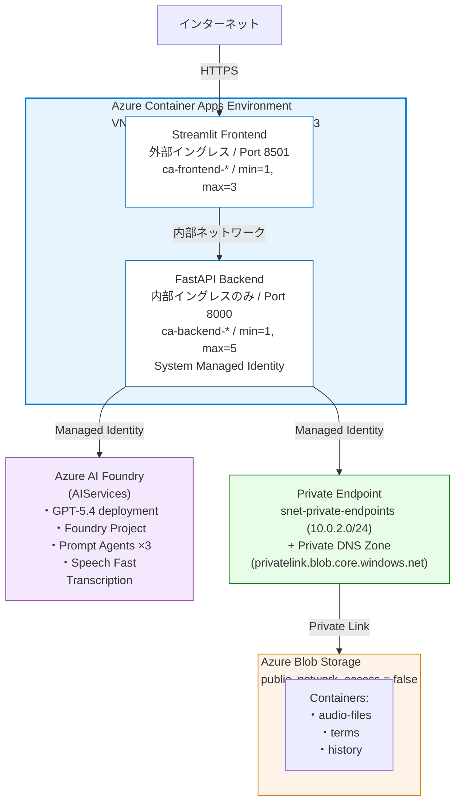
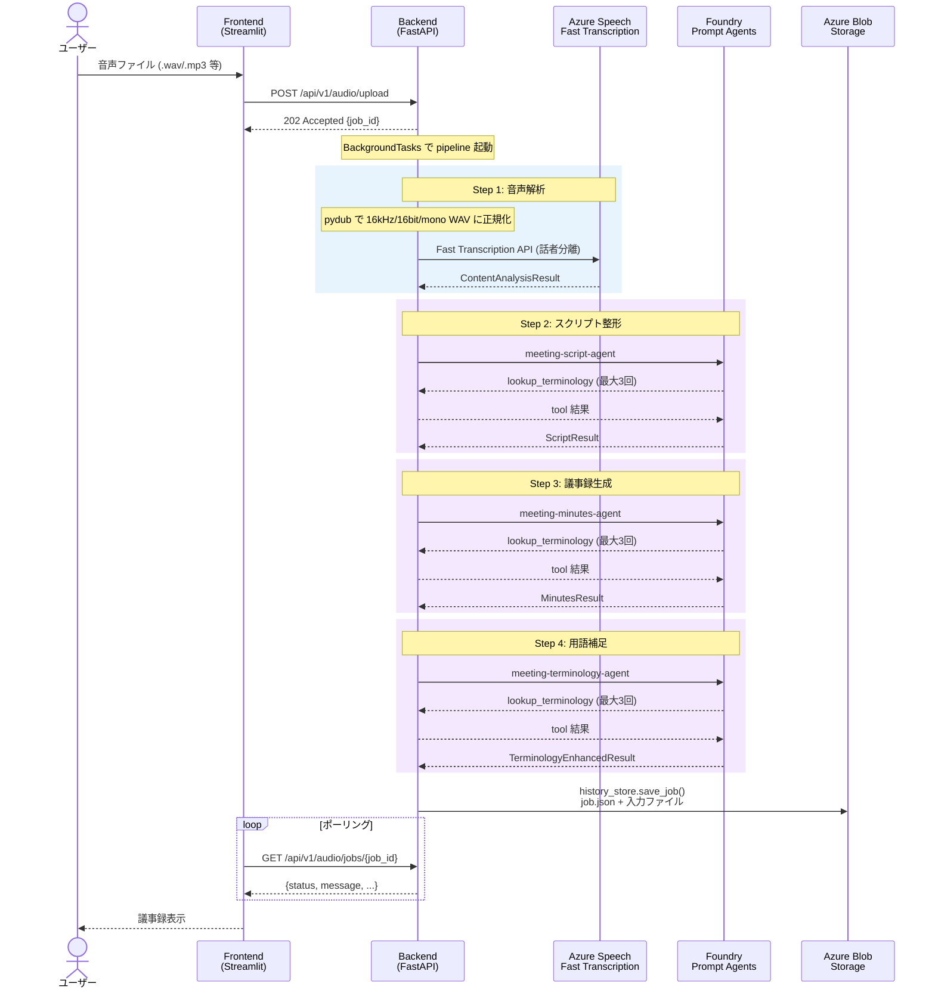
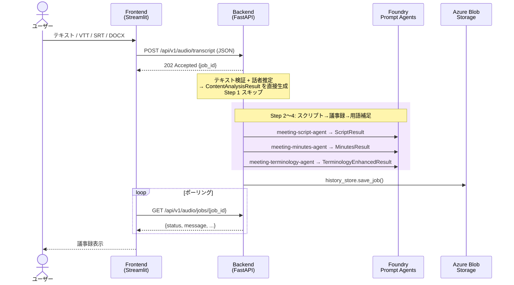
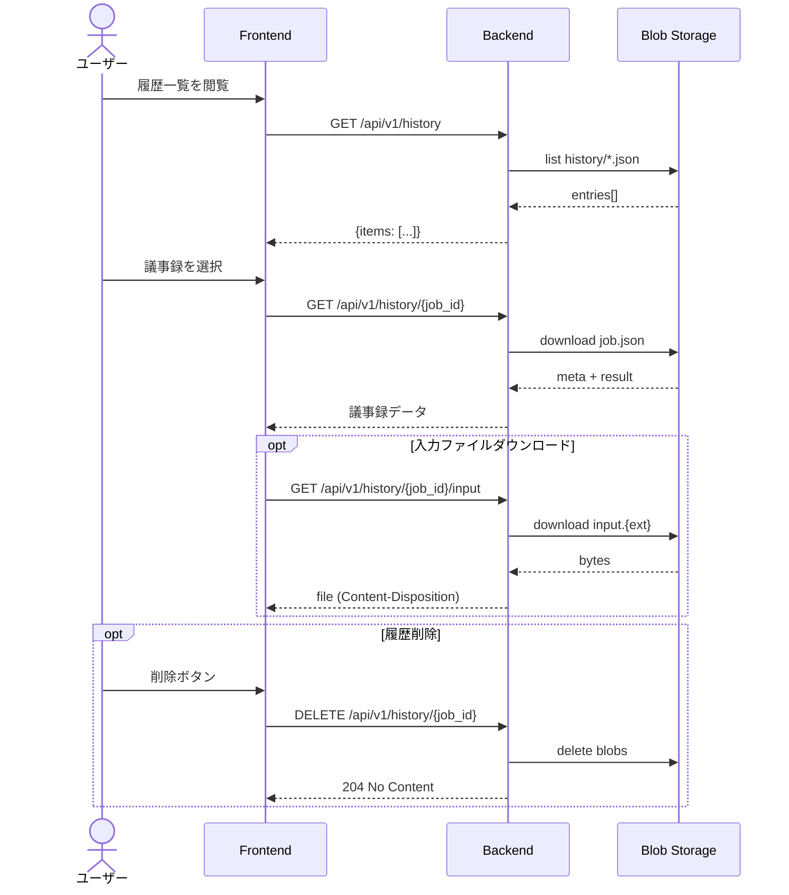
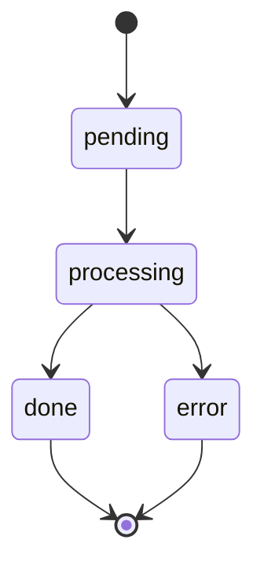
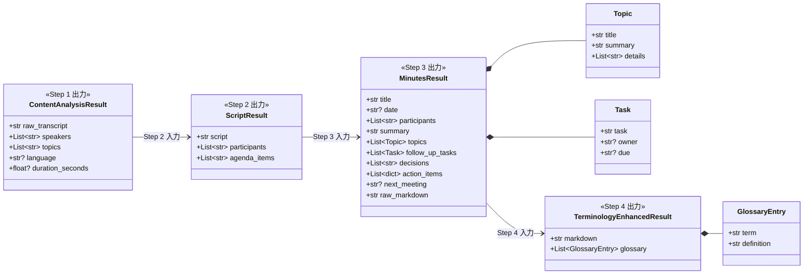
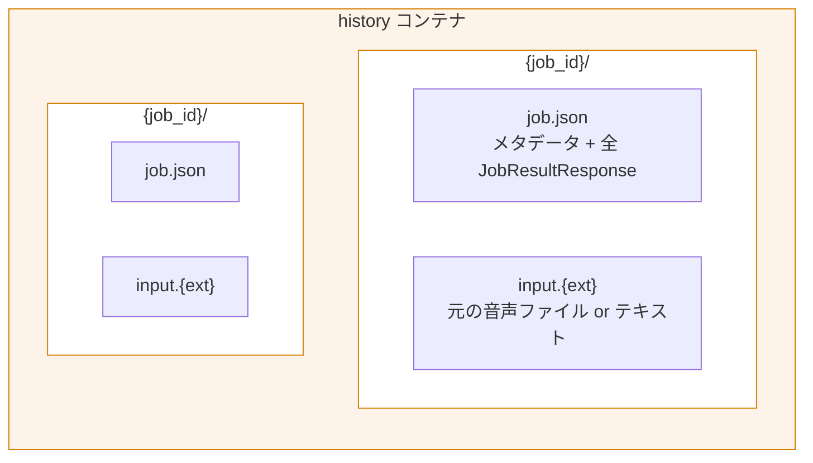
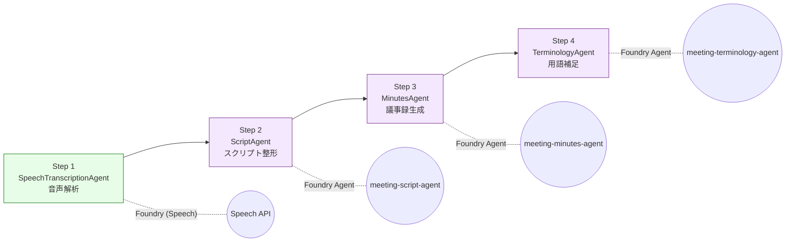
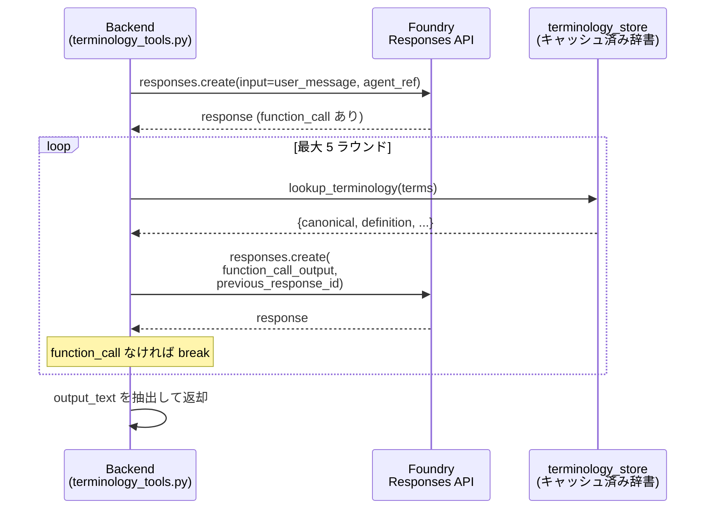
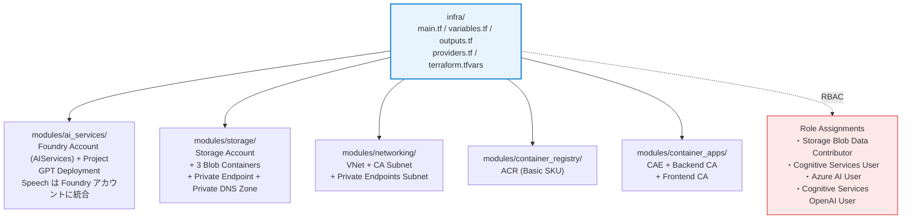

# Meeting Minutes Agent — システム設計書

> **最終更新日**: 2026-04-28  
> **バージョン**: 1.0.0

---

## 目次

1. [システム概要](#1-システム概要)
2. [アーキテクチャ](#2-アーキテクチャ)
3. [コンポーネント詳細](#3-コンポーネント詳細)
4. [データフロー](#4-データフロー)
5. [API 仕様](#5-api-仕様)
6. [データモデル](#6-データモデル)
7. [AI エージェント パイプライン](#7-ai-エージェント-パイプライン)
8. [用語辞書システム](#8-用語辞書システム)
9. [インフラストラクチャ](#9-インフラストラクチャ)
10. [認証・認可](#10-認証認可)
11. [デプロイメント](#11-デプロイメント)
12. [設定パラメータ](#12-設定パラメータ)
13. [運用ガイド](#13-運用ガイド)

---

## 1. システム概要

### 1.1 目的

音声ファイルまたは文字起こしテキストから、複数の AI エージェントが連携して構造化された議事録を自動生成するシステム。

### 1.2 主要機能

| 機能 | 説明 |
|------|------|
| 音声アップロード | WAV/MP3/MP4/M4A/OGG/WebM/FLAC 形式に対応（最大 100MB） |
| テキスト入力 | 文字起こし済みテキスト / VTT / SRT / DOCX ファイルの直接投入 |
| 話者分離 | Azure Speech Fast Transcription による最大 10 名の話者識別 |
| 4 段パイプライン | 音声解析 → スクリプト整形 → 議事録生成 → 用語補足 |
| 用語正規化 | Blob Storage 上の辞書を Function Calling ツールで参照し、表記統一＋インライン注釈 |
| 履歴管理 | 完了ジョブを Blob Storage に永続保存し、一覧・再表示・ダウンロード・削除が可能 |
| 非同期処理 | ジョブベースのポーリング方式（HTTP 202 → ステータスポーリング → 完了） |

### 1.3 技術スタック

| レイヤー | 技術 |
|----------|------|
| フロントエンド | Python / Streamlit 1.31+ |
| バックエンド | Python / FastAPI 0.111+ / Uvicorn |
| 言語モデル | Azure OpenAI GPT-5.4（Microsoft Foundry 経由） |
| 音声解析 | Azure Speech Fast Transcription API (2024-11-15) |
| エージェント基盤 | Microsoft Foundry Prompt Agent + Responses API |
| ストレージ | Azure Blob Storage（MI 認証、SAS/キー不使用） |
| コンテナ | Azure Container Apps（Consumption ワークロードプロファイル） |
| ネットワーク | Azure VNet 統合 + 内部イングレス |
| IaC | Terraform（azurerm + azapi プロバイダー） |
| 認証 | Managed Identity (DefaultAzureCredential) 一貫 |
| コンテナレジストリ | Azure Container Registry (Basic SKU) |

---

## 2. アーキテクチャ

### 2.1 全体構成図



### 2.2 ネットワーク構成

- **Frontend**: 外部イングレス（パブリック HTTPS）— ユーザーがブラウザからアクセス
- **Backend**: 内部イングレスのみ — VNet 内からのみ到達可能（インターネット非公開）
- **通信経路**: Frontend → Backend は `https://{backend-name}.internal.{env-domain}` で接続
- **Azure サービスへの通信**: Backend から Foundry (AIServices — Speech Fast Transcription + GPT) は Managed Identity で認証
- **Blob Storage への通信**: `public_network_access_enabled = false` のため、VNet 内の Private Endpoint (`snet-private-endpoints` 10.0.2.0/24) + Private DNS Zone (`privatelink.blob.core.windows.net`) 経由でアクセス

**サブネット構成**:

| サブネット | CIDR | 用途 |
|-----------|------|------|
| `snet-container-apps` | `10.0.0.0/23` | Container Apps Environment（委任済み） |
| `snet-private-endpoints` | `10.0.2.0/24` | Storage Private Endpoint |

---

## 3. コンポーネント詳細

### 3.1 フロントエンド (`frontend/`)

| 項目 | 値 |
|------|----|
| フレームワーク | Streamlit |
| エントリポイント | `app.py` |
| Docker ベースイメージ | `python:3.12-slim` |
| ポート | 8501 |
| 主要依存 | `streamlit`, `requests`, `pandas`, `python-docx` |

**主要機能**:
- 音声ファイルのアップロード UI（ドラッグ & ドロップ / ファイル選択）
- テキスト入力 UI（直接入力 / VTT・SRT・DOCX ファイルアップロード）
- ブラウザ録音機能
- ジョブ進捗のリアルタイム表示（ステータスポーリング）
- 議事録の Markdown レンダリング＋ダウンロード
- エージェント入出力の詳細パネル（Step 1〜4 の中間結果表示）
- 履歴一覧・閲覧・削除

**環境変数**:
| 変数名 | 説明 | デフォルト |
|--------|------|-----------|
| `BACKEND_URL` | バックエンド API の URL | `http://localhost:8000` |
| `POLL_INTERVAL_SECONDS` | ポーリング間隔（秒） | `3` |
| `MAX_WAIT_SECONDS` | 最大待機時間（秒） | `3600` |

### 3.2 バックエンド (`backend/`)

| 項目 | 値 |
|------|----|
| フレームワーク | FastAPI |
| エントリポイント | `app/main.py` |
| Docker ベースイメージ | `python:3.12-slim` |
| ポート | 8000 |
| ヘルスチェック | `GET /health` |

**ルーター構成**:

| ルーター | プレフィックス | ファイル |
|----------|--------------|---------|
| Audio | `/api/v1` | `routers/audio.py` |
| History | `/api/v1` | `routers/history.py` |

**主要依存**:
- `fastapi`, `uvicorn`, `pydantic`, `pydantic-settings`, `python-multipart`
- `openai` (2.0+) — Responses API 経由で Foundry Agent を呼び出し
- `azure-ai-projects` (2.1+) — Foundry Project / Agent 管理
- `azure-ai-agents` (1.1+) — AgentsClient
- `azure-identity` — DefaultAzureCredential
- `azure-storage-blob` — Blob Storage 接続
- `httpx` — Speech Fast Transcription API 呼び出し
- `pydub` — 音声ファイルの正規化（16 kHz/16-bit/mono WAV リサンプル、ffmpeg 必須）
- `aiofiles` — 非同期ファイル I/O
- `aiohttp` — 非同期 HTTP クライアント

### 3.3 エージェントモジュール (`backend/app/agents/`)

| モジュール | 役割 |
|------------|------|
| `speech_transcription.py` | Azure Speech Fast Transcription で音声→テキスト変換 |
| `script_agent.py` | 生テキストを整形スクリプトに変換 |
| `minutes_agent.py` | スクリプトから構造化議事録を生成 |
| `terminology_agent.py` | 議事録に用語集を付与 |
| `pipeline.py` | 4 エージェントの順次実行オーケストレーション |
| `foundry_client.py` | Microsoft Foundry / Azure OpenAI クライアントの共有インスタンス |
| `terminology_tools.py` | Foundry Prompt Agent の Function Calling ループ実装 |
| `terminology_store.py` | Blob Storage / ローカルからの用語辞書読み込み＋キャッシュ |
| `history_store.py` | 完了ジョブの Blob 永続化＋取得 |

---

## 4. データフロー

### 4.1 音声ファイル入力の場合



### 4.2 テキスト入力の場合



### 4.3 履歴取得フロー



---

## 5. API 仕様

### 5.1 Audio エンドポイント

#### `POST /api/v1/audio/upload`
音声ファイルをアップロードして議事録生成ジョブを開始する。

| 項目 | 値 |
|------|----|
| Content-Type | `multipart/form-data` |
| レスポンス | `202 Accepted` |
| ボディ | `file` (音声ファイル) |

**レスポンス例**:
```json
{
  "job_id": "uuid-string",
  "status": "pending",
  "message": "処理を開始しました"
}
```

**エラー**:
- `415`: 未対応のファイル形式
- `413`: ファイルサイズ超過

#### `POST /api/v1/audio/transcript`
文字起こし済みテキストから議事録生成を開始する。

| 項目 | 値 |
|------|----|
| Content-Type | `application/json` |
| レスポンス | `202 Accepted` |

**リクエスト例**:
```json
{
  "transcript": "司会：本日の議題は...",
  "speakers": ["司会", "田中"],
  "language": "ja"
}
```

#### `GET /api/v1/audio/jobs/{job_id}`
ジョブのステータスと結果を取得する。

**レスポンス例 (処理中)**:
```json
{
  "job_id": "uuid",
  "status": "processing",
  "message": "議事録を作成中..."
}
```

**レスポンス例 (完了)**:
```json
{
  "job_id": "uuid",
  "status": "done",
  "message": "完了しました",
  "content_analysis": { ... },
  "script": { ... },
  "minutes": { ... },
  "final_minutes": {
    "markdown": "# 会議タイトル\n...",
    "glossary": [{"term": "MCP", "definition": "..."}]
  }
}
```

### 5.2 History エンドポイント

| メソッド | パス | 説明 |
|----------|------|------|
| `GET` | `/api/v1/history` | 議事録履歴一覧（新しい順） |
| `GET` | `/api/v1/history/{job_id}` | 保存済み議事録の詳細 |
| `GET` | `/api/v1/history/{job_id}/input` | 入力ファイルのダウンロード |
| `DELETE` | `/api/v1/history/{job_id}` | 履歴削除 (`204 No Content`) |

### 5.3 ヘルスチェック

| メソッド | パス | 説明 |
|----------|------|------|
| `GET` | `/health` | Liveness probe（`{"status": "ok"}`） |

---

## 6. データモデル

### 6.1 ジョブステータス



| ステータス | 説明 |
|------------|------|
| `pending` | ジョブ受付済み、処理未開始 |
| `processing` | パイプライン処理中（進捗メッセージ付き） |
| `done` | 全ステップ完了 |
| `error` | エラー発生 |

### 6.2 中間データモデル



### 6.3 履歴データ (Blob Storage レイアウト)



**job.json 構造**:
```json
{
  "job_id": "uuid",
  "title": "会議タイトル",
  "created_at": "2026-04-23T10:00:00+00:00",
  "input_kind": "audio",
  "input_filename": "meeting.wav",
  "input_blob": "{job_id}/input.wav",
  "result": { /* full JobResultResponse */ }
}
```

---

## 7. AI エージェント パイプライン

### 7.1 パイプライン概要

4 つのエージェントが **順次実行** され、各ステップの出力が次のステップの入力となる。



### 7.2 Foundry Prompt Agent アーキテクチャ

Step 2〜4 は **Microsoft Foundry Prompt Agent** として事前登録されている。

**エージェント一覧**:

| agent_key | Foundry Agent 名 | 目的 |
|-----------|-------------------|------|
| `script` | `meeting-script-agent` | スクリプト整形 + 用語正規化 |
| `minutes` | `meeting-minutes-agent` | 構造化議事録生成 + 用語インライン注釈 |
| `terminology` | `meeting-terminology-agent` | 用語集セクション追加 |

**登録方法**: `backend/scripts/register_foundry_agents.py` で冪等に作成/更新

```bash
python backend/scripts/register_foundry_agents.py
```

### 7.3 Function Calling ループ

Foundry Agent は `lookup_terminology` Function Tool を定義しており、実行フローは以下の通り:



### 7.4 フォールバック

各エージェントは Foundry / Azure OpenAI が未設定の場合、モック結果を返す。これにより、AI サービスなしでもローカル開発が可能。

---

## 8. 用語辞書システム

### 8.1 概要

「Single Source of Truth」パターンで、1 つの JSON 辞書ファイルが全エージェントに共有される。

### 8.2 辞書スキーマ

```json
{
  "phrase_list": ["MCP", "Azure OpenAI", ...],
  "term_mappings": [
    {
      "variants": ["えむしーぴー", "エムシーピー", "MCP"],
      "canonical": "MCP",
      "definition": "Model Context Protocol。AI とデータソース/ツールを...",
      "category": "tech"
    }
  ]
}
```

| フィールド | 説明 |
|------------|------|
| `phrase_list` | Speech Phrase List 用（将来 Custom Speech 対応時） |
| `term_mappings[].variants` | 表記ゆれ候補（カタカナ・略語・誤変換を含む） |
| `term_mappings[].canonical` | 正式表記（スクリプト/議事録で統一される表記） |
| `term_mappings[].definition` | 用語の定義文 |
| `term_mappings[].category` | 分類 (`tech`, `azure`, `industry` 等) |

### 8.3 読み込み優先順位

1. **Azure Blob Storage** (`terms` コンテナの `terminology.json`) — Managed Identity で取得
2. **ローカルファイル** (`backend/app/data/terminology.json`) — Blob が取得不可の場合にフォールバック

### 8.4 キャッシュ

- インプロセスキャッシュ（TTL: `terminology_cache_ttl_seconds`、デフォルト 300 秒）
- `asyncio.Lock` による排他制御で重複フェッチを防止

### 8.5 lookup_terminology ツール

各エージェントから Function Calling で呼び出される同期関数。キャッシュ済み辞書に対してケースインセンシティブなマッチングを行い、`{requested, canonical, definition, variants, category}` を返す。

---

## 9. インフラストラクチャ

### 9.1 Terraform モジュール構成



```
    ├── ai_services/     # Azure AI Foundry アカウント (AIServices) + プロジェクト + GPT デプロイ（Speech も同一アカウント）
    ├── storage/         # ストレージアカウント + 3 コンテナ + Private Endpoint + Private DNS Zone
    ├── networking/      # VNet + Container Apps サブネット + Private Endpoints サブネット
    ├── container_registry/ # ACR
    └── container_apps/  # CAE + Backend CA + Frontend CA
```

### 9.2 Azure リソース一覧

| リソース | 名前パターン | 説明 |
|----------|-------------|------|
| Resource Group | `rg-meeting-minutes-agent` | 全リソースの親 |
| AI Services Account | `aif-{app}-{env}` | Foundry 互換 AIServices (kind=AIServices) |
| Foundry Project | `proj-{app}-{env}` | Foundry プロジェクト (azapi) |
| GPT Deployment | `gpt-5.4` | GlobalStandard SKU、30K TPM |
| Storage Account | `st{app}{env}` | Blob Storage（shared_access_key_enabled=false） |
| Blob Container | `audio-files` | 音声ファイル一時保存 |
| Blob Container | `terms` | 用語辞書 (terminology.json) |
| Blob Container | `history` | 議事録履歴永続化 |
| Virtual Network | `vnet-{app}-{env}` | 10.0.0.0/16 |
| Subnet | `snet-container-apps` | 10.0.0.0/23、Container Apps 委任 |
| Subnet | `snet-private-endpoints` | 10.0.2.0/24、Storage Private Endpoint 用 |
| Private Endpoint | `pe-blob-{sa_name}` | Blob Storage への Private Link 接続 |
| Private DNS Zone | `privatelink.blob.core.windows.net` | Storage Private Endpoint の名前解決 |
| Container Registry | ACR | Basic SKU |
| Log Analytics | `law-{app}-{env}` | Container Apps ログ集約 |
| Container Apps Env | `cae-{app}-{env}` | VNet 統合、Consumption プロファイル |
| Backend CA | `ca-backend-{app}-{env}` | 内部イングレス、1-5 レプリカ |
| Frontend CA | `ca-frontend-{app}-{env}` | 外部イングレス、1-3 レプリカ |

### 9.3 RBAC ロールアサインメント

Backend の System Managed Identity に対する割り当て:

| ロール | スコープ | 用途 |
|--------|---------|------|
| `Storage Blob Data Contributor` | Storage Account | Blob 読み書き (audio, terms, history) |
| `Cognitive Services User` | AI Services Account (Foundry) | Speech Fast Transcription |
| `Azure AI User` | AI Services Account (Foundry) | Foundry Project / Agent 操作 |
| `Cognitive Services OpenAI User` | AI Services Account (Foundry) | GPT モデル推論 |

---

## 10. 認証・認可

### 10.1 認証方式

**すべて Managed Identity (DefaultAzureCredential)** を使用。API キー・SAS トークンは不使用。

| 接続先 | 認証スコープ |
|--------|-------------|
| Azure Speech API | `https://cognitiveservices.azure.com/.default` |
| Azure OpenAI (直接) | `https://cognitiveservices.azure.com/.default` |
| Foundry Responses API | `https://ai.azure.com/.default` |
| Azure Blob Storage | DefaultAzureCredential（RBAC ベース） |

### 10.2 クライアント初期化の優先順位

1. `foundry_project_endpoint` が設定 → `AsyncOpenAI` (base_url = `{project}/openai/v1/`)
2. `azure_openai_endpoint` が設定 → `AsyncAzureOpenAI` (レガシーフォールバック)
3. 両方未設定 → モック動作

### 10.3 ストレージ認証

`shared_access_key_enabled = false` により、アカウントキーでのアクセスは完全に無効化。すべて RBAC ベースの Managed Identity 認証。

---

## 11. デプロイメント

### 11.1 コンテナイメージのビルドとプッシュ

```bash
# ACR ログイン
az acr login --name <acr-name>

# Backend ビルド & プッシュ
docker build -t <acr-server>/meeting-minutes-backend:<tag> ./backend
docker push <acr-server>/meeting-minutes-backend:<tag>

# Frontend ビルド & プッシュ
docker build -t <acr-server>/meeting-minutes-frontend:<tag> ./frontend
docker push <acr-server>/meeting-minutes-frontend:<tag>
```

### 11.2 インフラデプロイ

```bash
cd infra
terraform init
terraform plan -out=tfplan
terraform apply tfplan
```

### 11.3 イメージタグの更新

`terraform.tfvars` の `backend_image_tag` / `frontend_image_tag` を変更後:

```bash
terraform plan -out=tfplan
terraform apply tfplan
```

### 11.4 Foundry エージェント登録

```bash
az login
python backend/scripts/register_foundry_agents.py
```

冪等（`create_version` による upsert）。instructions やツール定義を変更した場合に再実行する。

### 11.5 用語辞書の更新

```bash
# Blob Storage に用語辞書をアップロード
az storage blob upload \
  --account-name <storage-account> \
  --container-name terms \
  --name terminology.json \
  --file backend/app/data/terminology.json \
  --auth-mode login
```

キャッシュ TTL（デフォルト 5 分）後に自動反映。

---

## 12. 設定パラメータ

### 12.1 バックエンド環境変数

| 変数名 | 説明 | デフォルト |
|--------|------|-----------|
| `AZURE_SPEECH_ENDPOINT` | Azure Speech エンドポイント（Foundry AIServices アカウントと同一） | `""` |
| `FOUNDRY_PROJECT_ENDPOINT` | Foundry プロジェクト エンドポイント | `""` |
| `FOUNDRY_MODEL_DEPLOYMENT` | Foundry モデルデプロイメント名 | `gpt-5.4` |
| `AZURE_OPENAI_ENDPOINT` | Azure OpenAI エンドポイント（レガシー） | `""` |
| `AZURE_OPENAI_DEPLOYMENT` | Azure OpenAI デプロイメント名（レガシー） | `gpt-5.4` |
| `AZURE_OPENAI_API_VERSION` | Azure OpenAI API バージョン | `2025-04-01-preview` |
| `AZURE_STORAGE_ACCOUNT_URL` | Blob Storage アカウント URL | `""` |
| `AZURE_STORAGE_CONTAINER` | 音声ファイル用コンテナ名 | `audio-files` |
| `AZURE_TERMS_CONTAINER` | 用語辞書コンテナ名 | `terms` |
| `AZURE_TERMS_BLOB` | 用語辞書 Blob 名 | `terminology.json` |
| `AZURE_HISTORY_CONTAINER` | 履歴コンテナ名 | `history` |
| `TERMINOLOGY_CACHE_TTL_SECONDS` | 用語辞書キャッシュ TTL（秒） | `300` |
| `MAX_AUDIO_SIZE_MB` | 最大音声ファイルサイズ (MB) | `100` |
| `SPEECH_POLL_TIMEOUT_SECONDS` | Speech API ポーリングタイムアウト | `300` |
| `SPEECH_POLL_INTERVAL_SECONDS` | Speech API ポーリング間隔 | `5` |

### 12.2 Terraform 変数

| 変数名 | デフォルト | 説明 |
|--------|-----------|------|
| `resource_group_name` | `rg-meeting-minutes-agent` | リソースグループ名 |
| `location` | `japaneast` | Azure リージョン |
| `environment` | `dev` | デプロイ環境 (dev/staging/prod) |
| `app_name` | `mtgminutes` | リソース名ベース |
| `openai_sku` | `S0` | Azure OpenAI SKU |
| `openai_model_name` | `gpt-5.4` | GPT モデル名 |
| `openai_model_version` | `2026-03-05` | GPT モデルバージョン |
| `openai_deployment_capacity` | `30` | TPM 容量 (千単位) |
| `storage_account_tier` | `Standard` | ストレージアカウントティア |
| `storage_replication_type` | `LRS` | ストレージレプリケーション種別 |
| `vnet_address_space` | `10.0.0.0/16` | VNet CIDR |
| `container_apps_subnet_cidr` | `10.0.0.0/23` | CA サブネット CIDR |
| `private_endpoints_subnet_cidr` | `10.0.2.0/24` | Private Endpoints サブネット CIDR（networking モジュール内で定義） |
| `acr_sku` | `Basic` | ACR SKU (Basic/Standard/Premium) |
| `backend_cpu` | `0.5` | Backend vCPU 割り当て |
| `backend_memory` | `1Gi` | Backend メモリ割り当て |
| `frontend_cpu` | `0.5` | Frontend vCPU 割り当て |
| `frontend_memory` | `1Gi` | Frontend メモリ割り当て |
| `backend_image_repo` | `meeting-minutes-backend` | Backend ACR リポジトリ名 |
| `backend_image_tag` | `latest` | Backend イメージタグ |
| `frontend_image_repo` | `meeting-minutes-frontend` | Frontend ACR リポジトリ名 |
| `frontend_image_tag` | `latest` | Frontend イメージタグ |
| `tag_environment` | `dev` | リソースタグ `environment` の値 |

---

## 13. 運用ガイド

### 13.1 インフラ変更ルール

- Azure リソースの変更は **必ず Terraform (`infra/`) を編集して `terraform apply`** で行う
- `az` CLI / ポータルで直接変更しない（ドリフト発生のため）
- やむを得ず CLI で先に変更した場合は、後で Terraform 側を実態に合わせて drift 解消

### 13.2 既知の制約

| 項目 | 説明 |
|------|------|
| ジョブストア | インメモリ（`_jobs` dict）。プロセス再起動で処理中ジョブは消失。完了済みジョブは Blob 履歴に永続化済み |
| Speech Phrase List | Fast Transcription API は `phraseList` 未対応。用語正規化は LLM エージェントに委任 |
| 音声正規化 | アップロードされた音声は pydub (ffmpeg) で 16 kHz / 16-bit / mono WAV にリサンプルしてから Speech API に送信。正規化に失敗した場合はオリジナルバイト列をそのまま送信するフォールバックあり |
| Storage コンテナ作成 | `Storage Blob Data Contributor` ロールではコンテナ作成不可。新規コンテナは Terraform で宣言 |
| 長時間音声 | Fast Transcription の応答待ちタイムアウトは httpx で最大 30 分 (read=1800s) に設定 |


### 13.3 ログ

- Backend: Python `logging` (INFO レベル) → Container Apps → Log Analytics Workspace
- Frontend: Streamlit 標準出力
- ログ保持期間: 30 日（`law-{app}-{env}` の `retention_in_days = 30`）

### 13.4 スケーリング

| コンポーネント | min | max | 条件 |
|----------------|-----|-----|------|
| Backend CA | 1 | 5 | Container Apps 自動スケーリング |
| Frontend CA | 1 | 3 | Container Apps 自動スケーリング |

### 13.5 ヘルスチェック

- Backend: Liveness probe `GET /health` (port 8000, 30 秒間隔, 3 回失敗で再起動)
- Frontend: Docker HEALTHCHECK (`/_stcore/health`)
